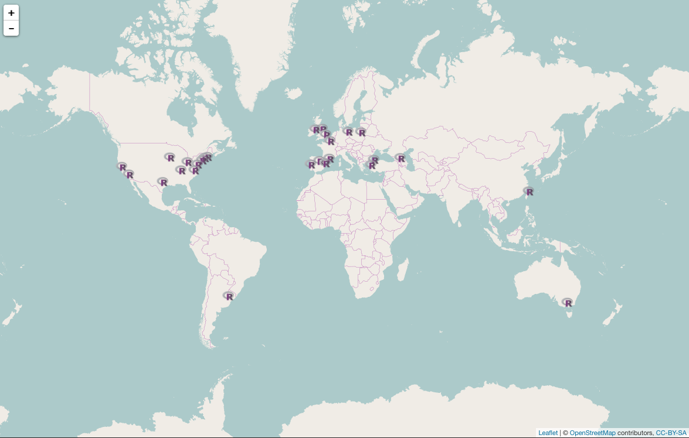
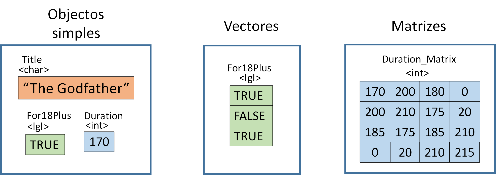
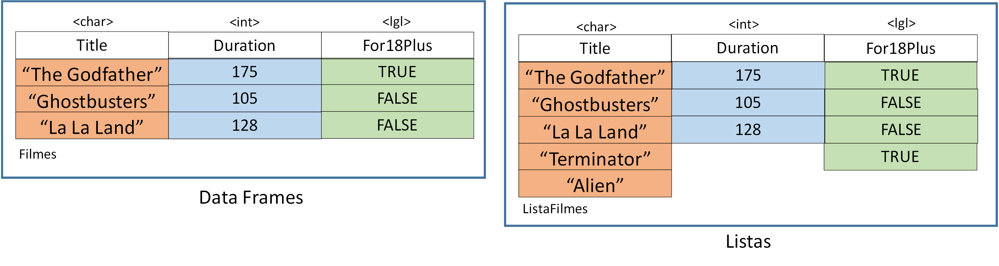
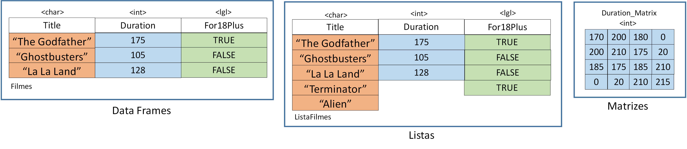

## Apresentação da comunidade R-Ladies 

### Objectivo: promover a diversidade de género na comunidade R.



4000 R-Ladies e 30 cidades iniciaram um grupo R-Ladies

--- &vcenter

**Programar não é uma atividade a solo. Devemos fazer perguntas e cooperar. Todos passamos pelas mesmas dificuldades.**

---
## Onde nos podem encontrar:

* meetup.com
* github.com
* twitter
* facebook
* rladies.org

## Contacto

**lisboa@rladies.org**

---
## Eventos futuros

* 22/04/2017: R, Machine Learning & Microsoft Azure
* 20/05/2017: R-Packages: Tidyverse, Dplyr


--- &vcenter 
## Agradecimentos


---
  
## Público-alvo

* Para quem nunca programou
* Para quem nunca programou em R
* Para quem já conhece o R mas precisa de saber conceitos básicos

---

## Conteúdos

* Tipos de dados 
* Atribuir valores a variáveis
* Estrutura de dados (vectores, matrizes e *dataframes*)
* Funções simples
* Ler dados a partir de ficheiros

---

## Introdução ao R-Studio

---

## Introdução ao R-Studio

### Podemos usar o R como uma calculadora


```r
2 + 2
```

```
## [1] 4
```

```r
2 * 6 + 9 * (10 ^ (-3) + 6 * 2)
```

```
## [1] 120.009
```


### **Exercício 1**

Experimentar um cálculo à escolha.

--- 


## Tipos de dados 

### Exemplo de base de dados simples


```r
# Filmes

#      ID          Title   Genre Duration Rating For18Plus
#   <int>          <chr>  <fctr>    <int>  <dbl>     <lgl>
# 1     1  The Godfather   Drama      175    9.2      TRUE
# 2     2 The Terminator  Action      107    8.0     FALSE
# 3     3     La La Land Musical      128    8.4     FALSE
# 4     4   Ghostbusters  Comedy      105    7.8     FALSE
# 5     5          Alien    <NA>       NA    6.1      TRUE
# 6     6           <NA>  Sci-Fi      107    6.7     FALSE
```

---

## Tipos de dados

A tabela possui diferentes tipos de dados:

* Title - character
* Genre - factor 
* Duration - integer
* Rating - double
* For18Plus - logical


---

## Tipos de dados


```r
typeof(Duration)
```

```
## [1] "integer"
```


```r
class(Duration)
```

```
## [1] "integer"
```


```r
str(Duration)
```

```
##  int [1:6] 175 107 128 105 NA 107
```


---


## Atribuir valores a variáveis

Armazenar valores em variáveis:

```r
Title <- "The Godfather"
```

Para ver o conteúdo de uma variável, devemos escrever o nome dela:

```r
Title
```

```
## [1] "The Godfather"
```

### **Exercício 2**
Criar a variável Genre com o valor "Drama".

---


## Estrutura de dados

* Vectores e matrizes: todos os elementos são do mesmo tipo.
  


---

## Estrutura de dados

* Data frames e listas: colunas podem ter tipos diferentes



---


## Vectores

Usar c() para concatenar valores:

```r
Title <- c("The Godfather", "The Terminator", "La La Land", "Ghostbusters", "Alien")
Title
```

```
## [1] "The Godfather"  "The Terminator" "La La Land"     "Ghostbusters"  
## [5] "Alien"
```

Usar sequências:

```r
ID <- 1:10
ID
```

```
##  [1]  1  2  3  4  5  6  7  8  9 10
```

--- 
## Vectores

Usar seq() para uma sequência com intervalos de 5:


```r
Duration <- seq(170, 190, by = 5)
Duration
```

```
## [1] 170 175 180 185 190
```

---

## Vectores

Criar uma sequência com repetição:

```r
Rating <- rep(c(1, 5, 3), times = 3)
Rating
```

```
## [1] 1 5 3 1 5 3 1 5 3
```

Repetir cada valor numa sequência:

```r
Rating <- rep(c(1, 5, 3), each = 3)
Rating 
```

```
## [1] 1 1 1 5 5 5 3 3 3
```

--- 

## Vectores

Aceder a elementos de um vector:

```r
Genre <- c("Drama", "Action", "Musical", "Comedy", "Sci-Fi")
Genre[1]
```

```
## [1] "Drama"
```

**Nota:** Os índices em R começam em [1], ao contrário de outras linguagens (Python, Java, C) que começam em [0].

--- 
## Vectores

### **Exercício 3:** 

* Criar vector For18Plus com valores na tabela.

* Aceder ao 3º elemento do vector For18Plus.

```r
# Filmes

#      ID          Title   Genre Duration Rating For18Plus
#   <int>          <chr>   <chr>    <int>  <dbl>     <lgl>
# 1     1  The Godfather   Drama      175    9.2      TRUE
# 2     2 The Terminator  Action      107    8.0     FALSE
# 3     3     La La Land Musical      128    8.4     FALSE
# 4     4   Ghostbusters  Comedy      105    7.8     FALSE
# 5     5          Alien    <NA>       NA    6.1      TRUE
# 6     6           <NA>  Sci-Fi      107    6.7     FALSE
```


---


## Matrizes

Estruturas multidimensionais que assumem apenas 1 tipo de dados

Criar matriz:

```r
m <- matrix(1:36, nrow = 6, ncol = 6)
m
```

```
##      [,1] [,2] [,3] [,4] [,5] [,6]
## [1,]    1    7   13   19   25   31
## [2,]    2    8   14   20   26   32
## [3,]    3    9   15   21   27   33
## [4,]    4   10   16   22   28   34
## [5,]    5   11   17   23   29   35
## [6,]    6   12   18   24   30   36
```

---

## Matrizes

Aceder a elementos da matriz:

```r
m[2,3] # Aceder a um elemento
```

```
## [1] 14
```

```r
m[2, ] # Aceder a uma linha
```

```
## [1]  2  8 14 20 26 32
```

```r
m[ ,1] # Aceder a uma coluna
```

```
## [1] 1 2 3 4 5 6
```

---

## Matrizes

Concatenar matrizes: adicionar coluna

```r
cbind(m,c(101,102,103,104,105,106)) # adicionar mais uma coluna
```

```
##      [,1] [,2] [,3] [,4] [,5] [,6] [,7]
## [1,]    1    7   13   19   25   31  101
## [2,]    2    8   14   20   26   32  102
## [3,]    3    9   15   21   27   33  103
## [4,]    4   10   16   22   28   34  104
## [5,]    5   11   17   23   29   35  105
## [6,]    6   12   18   24   30   36  106
```

---

## Matrizes

Concatenar matrizes: adicionar linha

```r
rbind(m,c(101,102,103,104,105,106)) # adicionar mais uma linha
```

```
##      [,1] [,2] [,3] [,4] [,5] [,6]
## [1,]    1    7   13   19   25   31
## [2,]    2    8   14   20   26   32
## [3,]    3    9   15   21   27   33
## [4,]    4   10   16   22   28   34
## [5,]    5   11   17   23   29   35
## [6,]    6   12   18   24   30   36
## [7,]  101  102  103  104  105  106
```

---

## Matrizes

### **Exercício 4:** 

* Criar uma matriz com os valores de 1 a 6, com 2 linhas e 3 colunas.

* Criar a mesma matriz mas com 3 linhas e 2 colunas.

---


## Dataframes

Estruturas multidimensionais usadas para armazenar tabelas:

```r
Filmes <- data.frame(ID = 1:6, Duration = c(175,107,128,105,NA,107), 
Title = c("The Godfather", "The Terminator", "La La Land", "Ghostbusters", "Alien", NA))
Filmes
```

```
##   ID Duration          Title
## 1  1      175  The Godfather
## 2  2      107 The Terminator
## 3  3      128     La La Land
## 4  4      105   Ghostbusters
## 5  5       NA          Alien
## 6  6      107           <NA>
```

---

## Dataframes


Uma *dataframe* pode ser interpretada como:

* uma lista
* uma matriz



---

## Dataframes

Aceder a elementos de uma *dataframe* 


```r
# Aceder por índice:
Filmes[2,2]
```

```
## [1] 107
```


```r
# Aceder por nome da variável/coluna:
Filmes$Duration
```

```
## [1] 175 107 128 105  NA 107
```

---

## Dataframes

Descobrir mais sobre uma *dataframe*

```r
nrow(Filmes) # Número de observações/linhas
```

```
## [1] 6
```

```r
ncol(Filmes) # Número de variáveis/colunas
```

```
## [1] 3
```

```r
dim(Filmes) # Número de linhas e colunas
```

```
## [1] 6 3
```

---

## Dataframes

Visualizar a *dataframe*

```r
head(Filmes) # Ver as primeiras 6 observações
```

```
##   ID Duration          Title
## 1  1      175  The Godfather
## 2  2      107 The Terminator
## 3  3      128     La La Land
## 4  4      105   Ghostbusters
## 5  5       NA          Alien
## 6  6      107           <NA>
```

---
## Dataframes

Visualizar a *dataframe*

```r
head(Filmes, 3) # Ver apenas 3 observações
```

```
##   ID Duration          Title
## 1  1      175  The Godfather
## 2  2      107 The Terminator
## 3  3      128     La La Land
```


```r
View(Filmes) # Ver a dataframe completa
```

---

## Dataframes


### **Exercício 5:** 

* Completar o código com os dados que faltam. 
* Visualizar a *dataframe* Filmes com o comando 'head'

```r
Filmes <- data.frame(ID = 1:6, 
Title = c("The Godfather", "The Terminator", "La La Land", "Ghostbusters", "Alien", NA))
```

---


## Valores em falta (missing values)

NA significa "Not Available", "Not Applicable" ou "Not Announced"

```r
# Filmes

#      ID          Title   Genre Duration Rating For18Plus
#   <int>          <chr>   <chr>    <int>  <dbl>     <lgl>
# 1     1  The Godfather   Drama      175    9.2      TRUE
# 2     2 The Terminator  Action      107    8.0     FALSE
# 3     3     La La Land Musical      128    8.4     FALSE
# 4     4   Ghostbusters  Comedy      105    7.8     FALSE
# 5     5          Alien    <NA>       NA    6.1      TRUE
# 6     6           <NA>  Sci-Fi      107    6.7     FALSE
```

---

## Valores em falta (missing values)

Identificar NA's

```r
is.na(Filmes$Title)
```

```
## [1] FALSE FALSE FALSE FALSE FALSE  TRUE
```


```r
complete.cases(Filmes)
```

```
## [1]  TRUE  TRUE  TRUE  TRUE FALSE FALSE
```

---

## Valores em falta (missing values)

Propagaçao de NA's.

```r
3 + NA
```

```
## [1] NA
```


```r
x <- c(1, 0, 2, 4, NA, 5)
mean(x)
```

```
## [1] NA
```


```r
mean(x, na.rm = TRUE)
```

```
## [1] 2.4
```

---

## Valores em falta (missing values)

Eliminar NA's


```r
Filmes[!is.na(Filmes$Title),]
```

```
##   ID Duration          Title
## 1  1      175  The Godfather
## 2  2      107 The Terminator
## 3  3      128     La La Land
## 4  4      105   Ghostbusters
## 5  5       NA          Alien
```

---


## Funções

As funções englobam uma tarefa numa única linha de código

Porquê utilizar funções:

* Reutilizar código
* Melhorar a legibilidade
* Dividir um problema noutros mais pequenos e fáceis de resolver

---

## Funções


```r
valor_medio <- function(vector){
  
  soma <- sum(vector)
  N <- length(vector)
  valor_medio <- soma / N
  
  return(valor_medio)
}
```

Utilizar a função:

```r
valor_medio(c(2,3,2,3))
```

```
## [1] 2.5
```

---

## Funções

Exemplo: Escolher um filme 


```r
FilmeOk <- function(Nome_Filme){
  
  Filme <- Filmes[Filmes$Title == Nome_Filme,]

  if(Filme$Rating < 6.3) {
    print("Má escolha")

    } else {
    print("Boa escolha")
    }
}

FilmeOk("Alien")
```

```
## [1] "Má escolha"
```

---


## Ler dados a partir de ficheiros


```r
df <- read.csv('C:/Users/GICpr/Desktop/exemplo.csv')
df
```

```
##    Nome Idade
## 1  Joao    25
## 2  Ines    23
## 3   Ana    30
## 4 Pedro    29
```

---

## Let's swirl:

```r
install.packages("swirl")
library(swirl)
install_from_swirl("R_Programming")

swirl() # Iniciar o Swirl
```

---
## Referências

* [Cheat sheet]("https://www.rstudio.com/wp-content/uploads/2016/05/base-r.pdf")
* https://www.coursera.org/learn/r-programming/lecture/pAbaE/overview-and-history-of-r
* https://github.com/rladies/meetup-presentations_london/blob/master/2016-10_Beginner_Dropin/slides.Rmd
* https://ase.tufts.edu/bugs/guide/assets/R%20Cookbook.pdf


